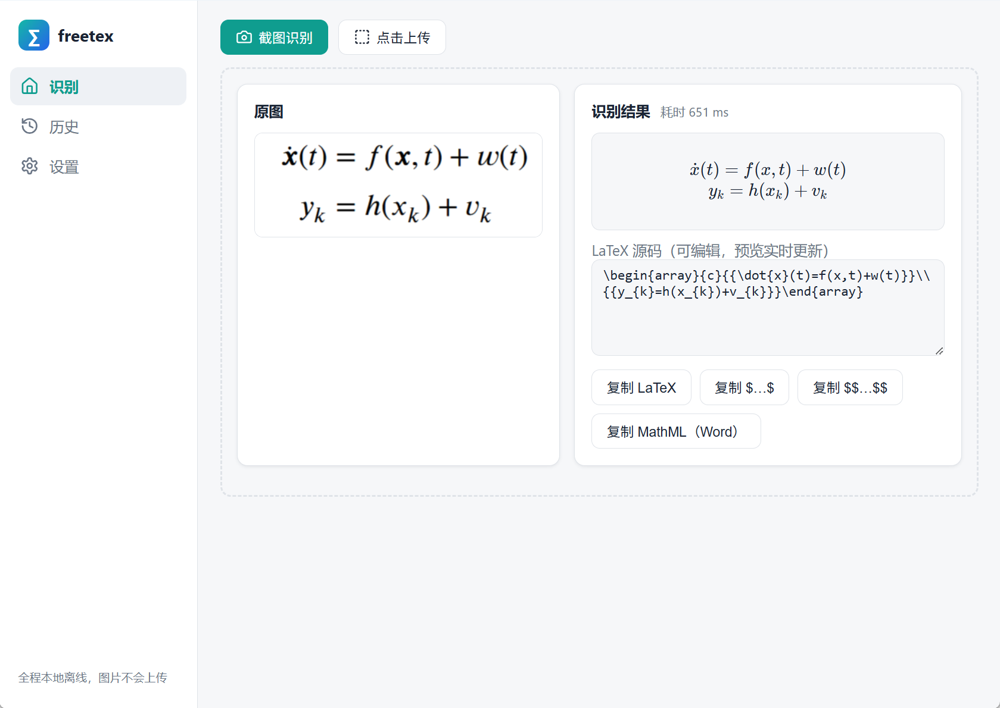

<div align="center">


# freetex

**Open-source desktop formula OCR · fully offline**

[](https://github.com/cislunarspace/freetex/actions/workflows/ci.yml)
[](https://github.com/cislunarspace/freetex/actions/workflows/release.yml)
[](https://github.com/cislunarspace/freetex/releases)
[](https://github.com/cislunarspace/freetex/releases)
[](LICENSE)
[](https://github.com/cislunarspace/freetex/releases)

**English** | [简体中文](README.zh-CN.md)

</div>



Snip or paste a formula image and freetex recognizes it locally as LaTeX, straight onto your clipboard — an open-source, offline alternative to SimpleTex. Images never leave your machine: no accounts, no uploads, no quotas. The engine is the [LaTeX-OCR (pix2tex)](https://github.com/lukas-blecher/LaTeX-OCR) ONNX model running on CPU.

## Installation

Grab the package for your platform from [Releases](https://github.com/cislunarspace/freetex/releases):

| Platform | Package |
|---|---|
| Windows x64 / arm64 | `*-setup.exe` or `.msi` |
| Linux x64 / arm64 | `.deb` / `.rpm` / `.AppImage` (Ubuntu 22.04 / 24.04 / 26.04 and comparable distros) |

On first launch, download the recognition model (~180 MB, one time) on the **Settings** page.

## Features

- 📸 Snip via hotkey (F9 by default), drag & drop, Ctrl+V paste, or upload
- ⚡ Local offline recognition with live KaTeX preview and an editable LaTeX source
- 📋 Copy as LaTeX / `$…$` / `$$…$$` / MathML (pastes as an equation in Word)
- 🗂 Local history (text only, images are never stored)
- 🔄 Auto-update checks (in-place for NSIS / AppImage)
- 🌙 Light/dark themes, English & Chinese, tray icon

## Build from source

```bash
git clone https://github.com/cislunarspace/freetex && cd freetex
cd frontend && npm install && cd ..
npx --prefix frontend tauri dev    # develop
npx --prefix frontend tauri build  # build
```

## Documentation

- [Architecture](docs/architecture.md)
- [Config template](configs/freetex.toml) (mirror env vars documented inline)
- [Changelog](CHANGELOG.md)
- [Contributing](AGENTS.md)

<div align="center">

## Star History

[](https://star-history.com/#cislunarspace/freetex&Date)

## License

[MIT](LICENSE)

</div>
